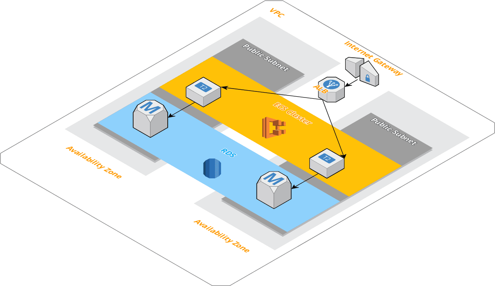
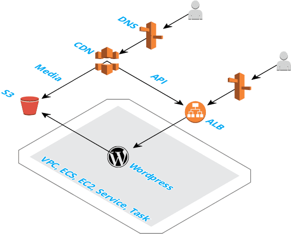

# Headless Wordpress Deployment using AWS CloudFormation
Quikly spin up a headless Wordpress deployment using AWS CloudFormation.

[](diagram1.png)


[](diagram2.png)

Infrastructure as Code (IaC) is the recommended way to manage the cloud infrastructure that your
application runs on.  IaC allows you to incrementailly add/remove infrastructure as your application changes.

IaC really shines when you need to spin up a new environment.  Lets say you get a huge customer who wants
to be on their own instance.  You can be up in running withing the hour.

This project contains 5 CloudFormation scripts.  They must be created in order because they depend on each other:
1. VPC
2. ECS
3. RDS
4. ECR
5. Wordpress

# Prerequisites
- [AWS Account](https://aws.amazon.com/)
- [EC2 Key Pair](https://console.aws.amazon.com/ec2/v2/home)
- cim - (`npm install -g cim`)
- [AWS CLI](https://docs.aws.amazon.com/cli/latest/userguide/installing.html)
- [SSL cert](https://console.aws.amazon.com/acm/home/) 
- https://docs.aws.amazon.com/Route53/latest/DeveloperGuide/CreatingHostedZone.html
- 


# Stacks

## VPC
This creates the [Amazon Virtual Private Cloud](https://aws.amazon.com/vpc/) that our ECS cluster and RDS database will run in.  
> Amazon Virtual Private Cloud (Amazon VPC) lets you provision a logically isolated section of the AWS Cloud where you can launch AWS resources in a virtual network that you define. 
```
cd vpc
cim stack-up
```

## ECS
This creates an [Elastic Container Service](https://aws.amazon.com/ecs/) that our EC2's will run in.
> Amazon Elastic Container Service (Amazon ECS) is a highly scalable, high-performance container orchestration service that supports Docker containers and allows you to easily run and scale containerized applications on AWS.
```
cd vpc
cim stack-up
```

## RDS
This creates a [Relational Database Service](https://aws.amazon.com/rds/) database cluster that our Wordpress application will use.
> Amazon Relational Database Service (Amazon RDS) makes it easy to set up, operate, and scale a relational database in the cloud.
```
cd rds
export DatabaseUsername="???"; export DatabasePassword="???"; cim stack-up
```

## ECR
This creates an [Elastic Container Registry](https://aws.amazon.com/ecr/) that will hold the docker images of our wordpress service.
> Amazon Elastic Container Registry (ECR) is a fully-managed Docker container registry that makes it easy for developers to store, manage, and deploy Docker container images.
```
cd ecr
cim stack-up
```

You'll recive an output from this command something like:
```
Stack has been created!
WPServiceRepositoryUrl = <accout_id>.dkr.ecr.<region>.amazonaws.com/STACK_NAME-wordpress
WPServiceRepository = STACK_NAME-wordpress
```

These outputs will be needed 

### Wordpress
Before we can launch this cloudformation stack.  We need to push our service image to ECR.

#### Changes to WP-APIs
Make all needed changes then run (in `wordpress/src`):
`rm -f setup/mod_twentytwenty.zip && zip -r setup/mod_twentytwenty.zip setup/mod_twentytwenty`

#### Push Image
```
cd wordpress/src
```
- [Registry Authentication](http://docs.aws.amazon.com/AmazonECR/latest/userguide/Registries.html#registry_auth)
  - `eval $(aws ecr get-login --no-include-email --region <region>)`
- Build Image
  - `docker build -t <WPServiceRepository> .` (use the WPServiceRepository from the ecr step)
- [Push Image](http://docs.aws.amazon.com/AmazonECR/latest/userguide/docker-push-ecr-image.html)
  - `docker tag <WPServiceRepository> <WPServiceRepositoryUrl>`
  - `docker push <WPServiceRepositoryUrl>` 

**NOTE** Theres a build script `scripts/build_wp.sh`, but before you use it, you must update all the `<>`s, such as `<region>`.

#### Update Version
Make sure the `Version` parameter, in _cim.yml, matches the `version` tag from above.  The ECS Task Definition will pull the image from ECR.

#### Stack up
Once the `Version` is set you can use `cim stack-up` to update the stack with the new version.

**NOTE**: use the `INIT_DB` var to completely load the database using the XML file.

```
cd wordpress
eval $(egrep -v '^#' ../.env | xargs) cim stack-up
```

# Wordpress
Congratulations, your new Wordpress site is now available.  

First run through the Wordpress setup wizard.

Next enable some of the plugins we added.

Add a few blog posts and pages.

Then check out the API. Ex: `https://cdn.<your_domain>/wp-json/wp/v2/posts`

# Tear down
```
cd wordpress
eval $(egrep -v '^#' ../.env | xargs) cim stack-delete

cd ecr
eval $(egrep -v '^#' ../.env | xargs) cim stack-delete

cd rds
eval $(egrep -v '^#' ../.env | xargs) cim stack-delete

cd ecs
eval $(egrep -v '^#' ../.env | xargs) cim stack-delete

cd vpc
eval $(egrep -v '^#' ../.env | xargs) cim stack-delete
```

## Frontend

Do it by it's self. DO:
- update `serverless.yml`
- update `config.js`

# Running Locally
- ensure `wordpress/src/maiadb` is deleted (this is needed for a fresh install) or use INIT_DB="false"
- `docker-compose build`
- `docker-compose up`
- `docker-compose down` to remove
- go to `frontend` and `IS_LOCAL=true npm run dev`
